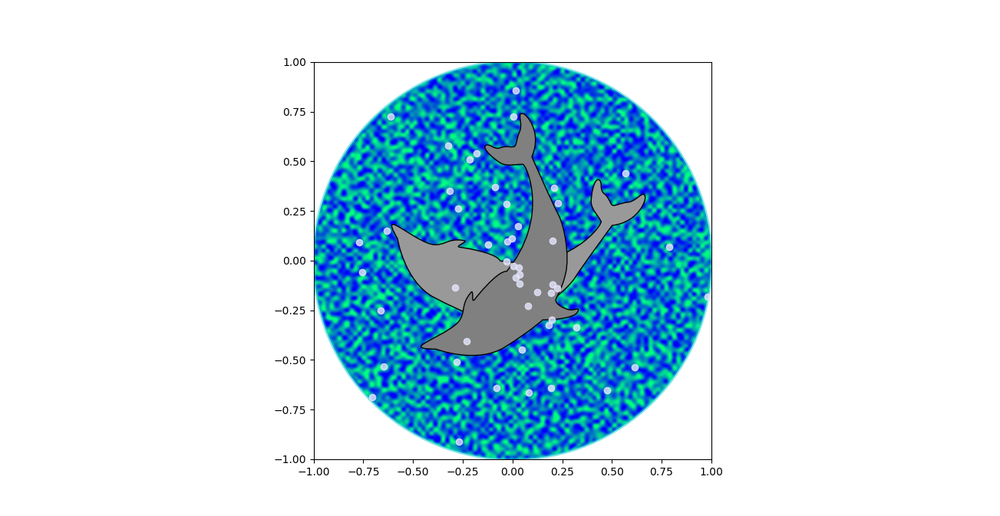

# lightML
Some basic machine learning algorithms:

- [KNN](https://github.com/jfzhang95/lightML/blob/master/SupervisedLearning/SVM.py)
- [LDA](https://github.com/jfzhang95/lightML/blob/master/SupervisedLearning/LinearClassification.py)
- [NaiveBayes](https://github.com/jfzhang95/lightML/blob/master/SupervisedLearning/NaiveBayes.py)
- [Linear Regression](https://github.com/jfzhang95/lightML/blob/master/SupervisedLearning/LinearRegression.py)
- [Logistic Regression](https://github.com/jfzhang95/lightML/blob/master/SupervisedLearning/LinearClassification.py)
- [Neural Networks](https://github.com/jfzhang95/lightML/blob/master/SupervisedLearning/NeuralNetwork.py)
- [RNN Layers](https://github.com/jfzhang95/lightML/blob/master/SupervisedLearning/NN/rnn_layers.py)
- [KMeans](https://github.com/jfzhang95/lightML/blob/master/UnsupervisedLearning/KMeans.py)

# Test
run test.py, you will see:

# License
This project is licensed under the terms of the MIT license.

